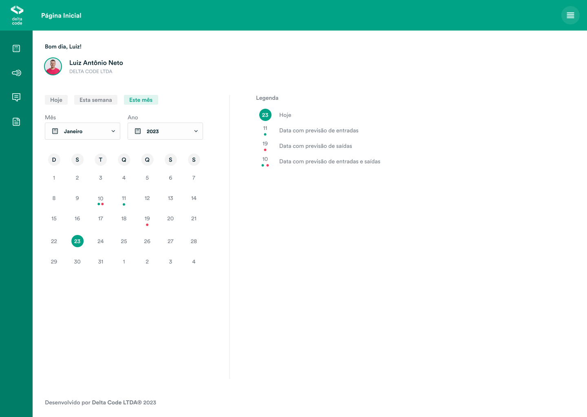

<h1>Desafio de Full-Stack Engineer</h1>

Bem-vindo ao desafio de <b>Full-Stack Engineer</b> da Delta Code!

    

## Orientações

- Antes de qualquer coisa, acesse [AQUI](https://www.figma.com/file/pmfrVwEEjDQgZlItVmjr9c/Challenge%3A-Delta-Code?node-id=0-1&t=5sAQEfWcEhmfaO46-0) o layout do desafio no Figma.
- As telas no layout são protótipos fictícios de uma aplicação desenvolvida pela Delta Code, havendo duas versões disponíveis: web e mobile.
- Escolha uma delas para desenvolver, ou, se preferir, pode desenvolver as duas. (Só esteja seguro de que terá tempo suficiente para desenvolver o teste em até 7 dias!)
- A aplicação mobile deverá ser desenvolvida em React Native e a aplicação web em React.
- O uso de TypeScript é opcional.
- Será necessário desenvolver um serviço de Back-end (ou API) que fornece os dados a aplicação.
- Importante: o objetivo deste teste é verificar a qualidade do seu código e como você resolve um problema específico. Além disso, é importante demonstrar que como desenvolvedor, você consegue replicar a interface que foi desenhada pela designer em código JavaScript.
- Por isso, existe uma restrição aqui: você DEVE desenvolver o componente de calendário DO ZERO, isto é, não utilizar uma lib externa para isso. É o ponto principal do teste!

#### O que você precisa desenvolver?

- No geral, você só precisa desenvolver o layout. A única parte que necessita ter interação é o componente de calendário.
- A primeira tela no mobile e na web representam o estado inicial da aplicação, que é quando você abre a página (na web) ou a tela (no mobile).
- Nesse estado inicial, vemos o dia de hoje destacado em verde e do lado (na web) ou embaixo (no mobile) vem uma legenda pra explicar o que os sinais e as cores significam.
- Quando o usuário seleciona um dia, aparecem os eventos daquele dia no lugar da legenda.

 

    <b>Boa sorte!</b>
     
    Desenvolvido com ❤️ pela equipe da <a href="https://github.com/delta-code-ltda">Delta Code</a>.

